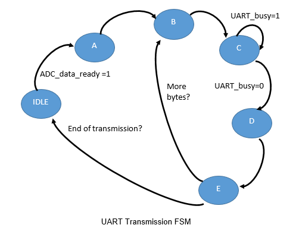

# Innerspec Embedded Systems Engineer Assignment
In this work I will present the tasks performed in relation to the practice for the job position of embedded systems engineer for Innerspec.
Although in this week, I have been trying to make contact with Qt, I have not managed to elaborate a UI similar to the mentioned one, mainly due to the question of the embedded Chart. So my work is mainly focused on the VHDL firmware of the FPGA.
A Basys3 development board was provided by Innerspec on Wednesday 20/05 at morning. So even though I had read the assignment on Friday, I was unable to start downloading designs to the chip until that day.
Regarding my prototyping tasks, I was working at home without the availability of a waveform generator. So I simulated the analog input with a potentiometer acting as a resistive divider.
In the JXADC PMOD connector, I used the 3.3V signal and its ground (pins 6-12 and 5-11 respectively). I connected a fixed resistor R1 at the top of the 1.1Mohm value divider and a 500kohm value potentiometer at the bottom. In this way, using the full linear range of the potentiometer, the one-volt limitation of the analog input channels is not exceeded.

Below is a photograph of the working situation. I use the multimeter to check if the values we are measuring though the serial match with the real input.

Next, I will describe how the different stages of the FPGA hardware design are structured. The layout consists of 6 .vhd files and this is how they are interconnected.

* [main.vhd](Innerspec_project.srcs/sources_1/new/main.vhd)
* [uart_tx.vhd](Innerspec_project.srcs/sources_1/new/UART_TX.vhd)
* [uart_rx.vhd](Innerspec_project.srcs/sources_1/new/UART_RX.vhd)
* [xadc_wiz_o.vhd](Innerspec_project.srcs/sources_1/ip/xadc_wiz_0/xadc_wiz_0.vhd)
* [acumulator.vhd](Innerspec_project.srcs/sources_1/new/acumulator.vhd)
* [fir_filter.vhd](Innerspec_project.srcs/sources_1/new/FIR.vhd)

For the interpretation of the commands from the UI, I have created a state machine in the serial reception. The PC will deliver the following commands:

* B↵: Starts
* Q↵: Stops
* A↵: Averaging Samples
* S↵: Sampling Rate
* D↵: Digitalize
* C↵: Coefficients

In the “Averaging samples”, “sampling rate”, “digitizer” and “coeffs” states, the machine states waits for the user to enter the corresponding data following by an enter.
Since all communication is via serial, I have had to develop a function package to work with ASCII characters. Functions to convert to ASCII and to convert from ASCII.

## [ACUMULATOR](Innerspec_project.srcs/sources_1/new/acumulator.vhd)

### ACUMULATOR_FSM

To simulate this component, a test_bench has been generated. The input _analog_data_ is a constant, which is what we acquired from the ADC in my situation. In the bench test it can be seen that when changing the buffer size to run the average, the accumulator response time changes. In 100us, _av_buffer_size_ = 16 and in 400us _av_buffer_size_ = 4;

## [MAIN](Innerspec_project.srcs/sources_1/new/main.vhd)
In the main, all other components are instantiated. It also contains three state machines to transmit through the serial port and to receive and decode the orders.

### TX_FSM

* A: read data and convert it to ASCII
* B: send byte to UART
* C: _data_valid_ = 1;
* D: _data_valid_ = 0
* E: wait until end of transmissión and check end of chars to send

### RX_FSM

This little state machine is only in charge of accumulating characters received by the serial port and waiting for the intro to arrive. When so, it activates a flag to call the main state machine of the reception.

* ACUM: Store data (max 32) until a CR+NL is received.
* END: State to send the Data Valid pulse.

### MAIN_RX_FSM

Transition diagram between states when a correct order from the uart is received

* SAMPLING RATE: read new adquisition frequency, and configure ADC. The three substates are to disable readings when changing the frequency.
* DIGITIZER; read digitizer factor. The substate is to check if we have read a correct positive value.
* START: rise _ADC_Start_
* STOP: _ADC_Start_ =0;
* AVERAGING SAMPLES: read the number of samples to do the average.The next substate is to check if exceed the maximum size of the buffer or if its negative
* COEFFS: Stay in the same state during the transmission of the 25 FIR coefficients.

## [UART_TX](Innerspec_project.srcs/sources_1/new/UART_TX.vhd)
115200 bauds, 8 bits plus start and stop and new line CR+NL.
Module taken from Nandland.
Waits for the CR+NL to interpretate a correct order.
Max length buffer, 32 chars

## [UART_RX](Innerspec_project.srcs/sources_1/new/UART_RX.vhd)
115200 bauds, 8 bits plus start and stop and new line CR+NL
Module taken from Nandland
Sends the outputs data from the filter.

## [FIR FILTER](Innerspec_project.srcs/sources_1/new/FIR.vhd)
The FIR filter model has been taken from the [vhdl.es website](https://vhdl.es/filtro-fir-vhdl/). It is a model for a low pass filter but with the [python script of the repository](master/Python/bandpass%20coeffs.py) another set of band pass coefficients can be generated. That script is already working and my idea was to do it in the high level UI and then send the coefficients through the serial port. But as I don’t have UI, I included a state in the RX_FSM to send the 25 coefficients through serial.
First calculating the coefficients with the [python script](master/Python/bandpass%20coeffs.py) and then generating an [input file](master/Python/input%20samples.txt), with [other script](master/Python/filtro%20fir%20fixed%20point.py), the same filter was run in a functional test_bench to see its behavior. The attached screenshot shows a wave with three frequencies at the input and as the output only contain the center frequency.

With the help of this test bench, the value of the filter digitizer has been calculated to adjust the output for that input to its maximum dynamic range. The start value of that scale factor is 12000. You can see how for this value of digitizer factor, the amplitude of the signal is around 2000 what is the maximum (2048) for a 12 bits signed signal.

## [ADC](Innerspec_project.srcs/sources_1/ip/xadc_wiz_0/xadc_wiz_0.vhd)

As an analog input I have configured the XADC thanks to its IP wizard to acquire, in a single channel, unipolar mode, and continuous signals from the VAUXP6 and VAUXN6 channels (pins J3 and K3 of the FPGA respectively). The XADC has a DRP interface and all alarms have been disabled.

## VIDEO CHANGING FREQ

<video>
  <source src="media/VID-20200524-WA0001.mp4">
</video>

## **Future Tasks**

This is the work that I have been able to do during this week. As tasks that have been incomplete or need more time I would highlight the following:
* Restructure code so that it can be interpreted easier.
* More debugging in some aspects, for example the reception with the uart in hardware.
* Try to find other programming methodologies so that the implementation in the FPGA will be more efficient. Regarding to this, I must say that in the current design the running phase synth_design has lasted up to an hour and a half.
* Work in the interface to have visual information and make the use more friendly than in the command line of the COM.
* Try the whole system with a waveform generator.

